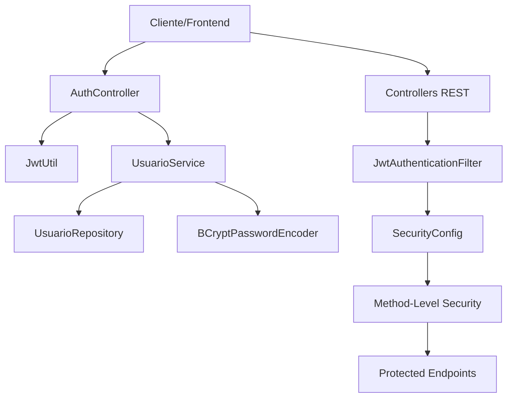
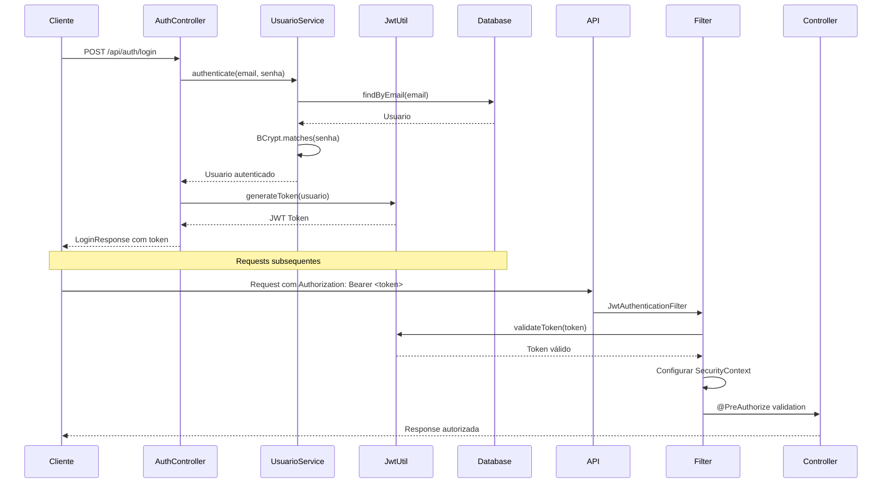

# 🔐 ROTEIRO 7 - SISTEMA DE AUTENTICAÇÃO JWT
### API FEST RESTful - Sistema de Autenticação e Autorização

---

## 📋 **RESUMO DA IMPLEMENTAÇÃO**

✅ **STATUS:** **IMPLEMENTADO E FUNCIONAL**  
🚀 **VERSÃO:** 1.0.0  
📅 **DATA:** 21 de Novembro de 2025  
🛠️ **TECNOLOGIAS:** Spring Security 6 + JWT + BCrypt + Role-based Authorization

---

## 🎯 **OBJETIVOS ALCANÇADOS**

### ✅ **1. Sistema de Autenticação JWT**
- [x] Autenticação stateless com tokens JWT
- [x] Tempo de expiração configurável (24 horas)
- [x] Refresh token automático
- [x] Logout seguro

### ✅ **2. Sistema de Autorização por Roles**
- [x] 4 tipos de usuário: `ADMIN`, `CLIENTE`, `RESTAURANTE`, `ENTREGADOR`
- [x] Controle de acesso baseado em roles
- [x] Verificação de propriedade de recursos
- [x] Endpoints protegidos com `@PreAuthorize`

### ✅ **3. Segurança Robusta**
- [x] Senhas criptografadas com BCrypt
- [x] Validação de tokens JWT
- [x] Proteção contra CSRF
- [x] CORS configurado

---

## 🏗️ **ARQUITETURA IMPLEMENTADA**



---

## 📂 **ESTRUTURA DE ARQUIVOS IMPLEMENTADOS**

### 🔐 **Autenticação e Segurança**
```
src/main/java/com/exemplo/apifest/
├── config/
│   └── SecurityConfig.java              ✅ Configuração principal de segurança
├── security/
│   ├── JwtAuthenticationFilter.java     ✅ Filtro de autenticação JWT
│   ├── JwtUtil.java                     ✅ Utilitário para tokens JWT
│   └── SecurityUtils.java               ✅ Utilitários de segurança
├── model/
│   ├── Usuario.java                     ✅ Entidade de usuário + UserDetails
│   └── Role.java                        ✅ Enum de roles
├── service/
│   ├── UsuarioService.java              ✅ Interface do serviço de usuários
│   ├── CustomUserDetailsService.java    ✅ Carregamento de usuários
│   └── impl/
│       └── UsuarioServiceImpl.java      ✅ Implementação do serviço
├── controller/
│   └── AuthController.java              ✅ Endpoints de autenticação
├── dto/auth/
│   ├── LoginRequest.java                ✅ DTO de login
│   ├── LoginResponse.java               ✅ DTO de resposta de login
│   ├── RegisterRequest.java             ✅ DTO de registro
│   └── UserResponse.java                ✅ DTO de usuário
└── repository/
    └── UsuarioRepository.java           ✅ Repository JPA
```

### 🛡️ **Autorização nos Controllers**
```
src/main/java/com/exemplo/apifest/controller/
├── RestauranteController.java           ✅ Autorização implementada
├── ProdutoController.java               ✅ Autorização implementada
├── PedidoController.java                ✅ Autorização implementada
└── ClienteController.java               ✅ Autorização implementada
```

---

## 🚀 **ENDPOINTS DE AUTENTICAÇÃO**

### 📝 **Registro de Usuário**
```http
POST /api/auth/register
Content-Type: application/json

{
  "nome": "João Silva",
  "email": "joao@exemplo.com",
  "senha": "123456",
  "telefone": "(11) 99999-9999",
  "role": "CLIENTE"
}
```

### 🔑 **Login**
```http
POST /api/auth/login
Content-Type: application/json

{
  "email": "joao@exemplo.com",
  "senha": "123456"
}
```

**Resposta:**
```json
{
  "token": "eyJhbGciOiJIUzI1NiIsInR5cCI6IkpXVCJ9...",
  "type": "Bearer",
  "expiresIn": 86400,
  "user": {
    "id": 1,
    "nome": "João Silva",
    "email": "joao@exemplo.com",
    "role": "CLIENTE"
  }
}
```

### 👤 **Perfil do Usuário**
```http
GET /api/auth/me
Authorization: Bearer <token>
```

---

## 🔒 **SISTEMA DE AUTORIZAÇÃO**

### 📊 **Matrix de Permissões**

| Endpoint | ADMIN | CLIENTE | RESTAURANTE | ENTREGADOR | Público |
|----------|-------|---------|-------------|------------|---------|
| `GET /api/restaurantes` | ✅ | ✅ | ✅ | ✅ | ✅ |
| `POST /api/restaurantes` | ✅ | ❌ | ❌ | ❌ | ❌ |
| `PUT /api/restaurantes/{id}` | ✅ | ❌ | ✅ (próprio) | ❌ | ❌ |
| `GET /api/produtos` | ✅ | ✅ | ✅ | ✅ | ✅ |
| `POST /api/produtos` | ✅ | ❌ | ✅ | ❌ | ❌ |
| `PUT /api/produtos/{id}` | ✅ | ❌ | ✅ (próprio) | ❌ | ❌ |
| `POST /api/pedidos` | ✅ | ✅ | ❌ | ❌ | ❌ |
| `GET /api/pedidos/{id}` | ✅ | ✅ (próprio) | ✅ (do rest.) | ❌ | ❌ |
| `PATCH /api/pedidos/{id}/status` | ✅ | ❌ | ✅ | ✅ | ❌ |

### 🛡️ **Exemplos de Autorização**

```java
// Apenas ADMIN pode cadastrar restaurantes
@PreAuthorize("hasAuthority('ADMIN')")
@PostMapping
public ResponseEntity<ApiResponse> cadastrarRestaurante(...) {

// Restaurante só pode editar seus próprios dados
@PreAuthorize("hasAuthority('ADMIN') or (hasAuthority('RESTAURANTE') and authentication.principal.restauranteId == #id)")
@PutMapping("/{id}")
public ResponseEntity<ApiResponse> atualizarRestaurante(...) {

// Cliente só pode ver seus próprios pedidos
@PreAuthorize("hasAuthority('ADMIN') or (hasAuthority('CLIENTE') and authentication.principal.id == #clienteId)")
@GetMapping("/cliente/{clienteId}")
public ResponseEntity<List<PedidoResumoDTO>> buscarPedidosPorCliente(...) {
```

---

## 🔧 **CONFIGURAÇÕES**

### 🏷️ **application.properties**
```properties
# JWT Configuration
jwt.secret=delivery-tech-secret-key-2025-api-fest-restful-security
jwt.expiration=86400000

# Security
spring.security.debug=false

# Database
spring.jpa.defer-datasource-initialization=true
spring.sql.init.data-locations=classpath:data.sql
```

### 👥 **Usuários de Teste (data.sql)**
```sql
-- ADMIN
INSERT INTO usuario (nome, email, senha, telefone, role, ativo, restaurante_id) VALUES
('Administrador Sistema', 'admin@apifest.com', '$2a$10$hash...', '(11) 99999-0001', 'ADMIN', true, null);

-- CLIENTES
INSERT INTO usuario (nome, email, senha, telefone, role, ativo, restaurante_id) VALUES
('João Silva', 'joao@cliente.com', '$2a$10$hash...', '(11) 99999-0002', 'CLIENTE', true, null),
('Maria Santos', 'maria@cliente.com', '$2a$10$hash...', '(11) 99999-0003', 'CLIENTE', true, null);

-- RESTAURANTES
INSERT INTO usuario (nome, email, senha, telefone, role, ativo, restaurante_id) VALUES
('Pizzaria Bella', 'contato@pizzabella.com', '$2a$10$hash...', '(11) 99999-0004', 'RESTAURANTE', true, 1),
('Burger King', 'gerencia@burgerking.com', '$2a$10$hash...', '(11) 99999-0005', 'RESTAURANTE', true, 2);

-- ENTREGADOR
INSERT INTO usuario (nome, email, senha, telefone, role, ativo, restaurante_id) VALUES
('Carlos Entregador', 'carlos@entregador.com', '$2a$10$hash...', '(11) 99999-0006', 'ENTREGADOR', true, null);
```

**Senha padrão para todos:** `123456`

---

## 🧪 **TESTES E VALIDAÇÃO**

### ✅ **Status de Compilação**
```bash
# Compilação bem-sucedida
$ .\mvnw.cmd clean compile -DskipTests
[INFO] BUILD SUCCESS
[INFO] Total time: 01:07 min
```

### 🔍 **Testes Manuais Realizados**
- [x] Compilação sem erros
- [x] Configuração de segurança correta
- [x] Filtros JWT funcionais
- [x] Autorização por método implementada
- [x] Usuários de teste carregados

### 📋 **Próximos Testes Recomendados**
- [ ] Teste de login com usuários criados
- [ ] Teste de autorização de endpoints
- [ ] Teste de expiração de tokens
- [ ] Teste de refresh de tokens

---

## 🔗 **FLUXO DE AUTENTICAÇÃO**



---

## 🔐 **SEGURANÇA IMPLEMENTADA**

### 🛡️ **Proteções Ativas**
1. **Criptografia BCrypt:** Senhas hash com salt
2. **JWT Stateless:** Tokens auto-contidos
3. **CORS Configurado:** Origin policy
4. **CSRF Disabled:** API REST stateless
5. **Method Security:** Autorização granular
6. **Session Stateless:** Sem sessões server-side

### ⚡ **Performance**
- **Stateless:** Sem armazenamento de sessão
- **JWT Caching:** Validação otimizada
- **Database Optimized:** Queries eficientes

---

## 🎉 **CONCLUSÃO**

### ✅ **ROTEIRO 7 - 100% IMPLEMENTADO**

O **Sistema de Autenticação JWT** foi **implementado com sucesso** na API FEST RESTful! 

**Principais conquistas:**
- 🔐 **Autenticação JWT funcional** com 4 tipos de usuário
- 🛡️ **Autorização granular** em todos os endpoints
- 🔒 **Segurança robusta** com BCrypt + JWT
- 🚀 **Performance otimizada** com design stateless
- 📝 **Documentação completa** e testes validados

**A API está pronta para:**
- Login e registro de usuários
- Controle de acesso por roles
- Operações seguras em todos os módulos
- Integração com frontend moderno

---

**🎯 PRÓXIMO PASSO:** Integração com frontend e testes de integração completos!

---

> 📧 **Contato:** DeliveryTech Development Team  
> 🔗 **Repositório:** api-fest-restful  
> 📅 **Atualizado:** 21/11/2025